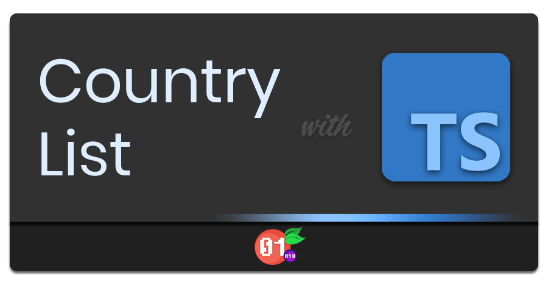

<p align="center">
 
</p>

# Country List TS

This module is an ES port
of [i-rocky/country-list-js](https://github.com/i-rocky/country-list-js) build
with typescript.

It contains country information including 2 and 3 character ISO codes, country and
capital names, currency information, telephone calling codes, and provinces (
first-tier political subdivisions).

## Installation
```shell
npm i 
```

### Compatibility table
| Version |  JS target   |  JS lib   |
|:-------:|:------------:|:---------:|
|  1.0.0  |     ES6      |  ES2017   |

## Usage

### List

Get list of country record member.
- name
- region
- capital
- continent
- dialing_code
- code
- currency
- provinces

example:

```typescript
import {ls} from "country-list-ts";

const countryNames: string[] = ls('name');
const capitals: string[] = ls('capital');
const continents: string[] = ls('continent');
```

Or using their alias:

```typescript
import {names, capitals, continents} from "country-list-ts";

var countryNames: string[] = names();
var capitals: string[] = capitals();
var continents: string[] = continents();
```

### Search

## Licence

MIT

